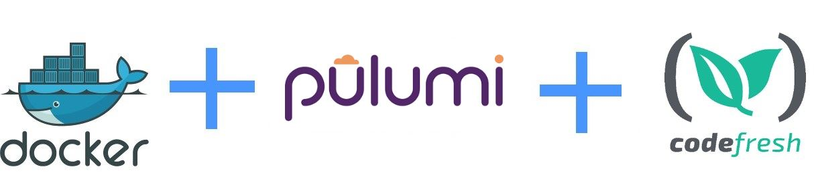

# Using Pulumi inside Docker with Codefresh

This is an example Pulumi application that runs in a Codefresh pipeline using docker.
More details can be found in [the documentation page](https://codefresh.io/docs/docs/yaml-examples/examples/pulumi).

## Prerequisites

1. Create a [free Codefresh account](https://codefresh.io/docs/docs/getting-started/create-a-codefresh-account/)
1. Create a [free Pulumi account](https://pulumi.io/quickstart/)
1. Create a [Pulumi access token](https://app.pulumi.com/account/tokens)
1. Create a kubernetes cluster on any cloud provider
1. Connect your [cluster to Codefresh](https://codefresh.io/docs/docs/deploy-to-kubernetes/add-kubernetes-cluster/)

## Create Codefresh pipeline

To use Pulumi with Codefresh

1. Create a new pipeline
1. Add you pulumi token as a variable called `PULUMI_ACCESS_TOKEN`
1. Add the [pipeline content](codefresh.yml)
1. Change the name of the cluster to reflect your own in the `kubectl config use-context` command

That's it! Run the pipeline to see it in action.

Enjoy!

